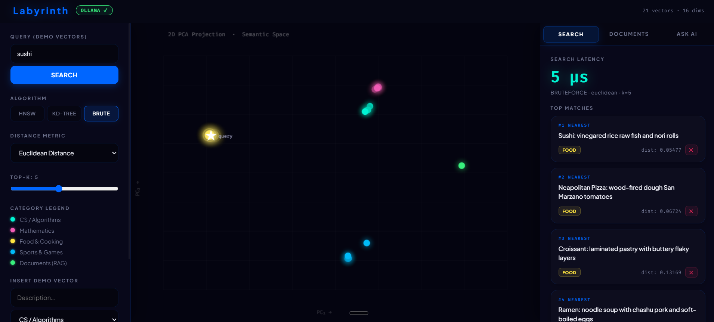
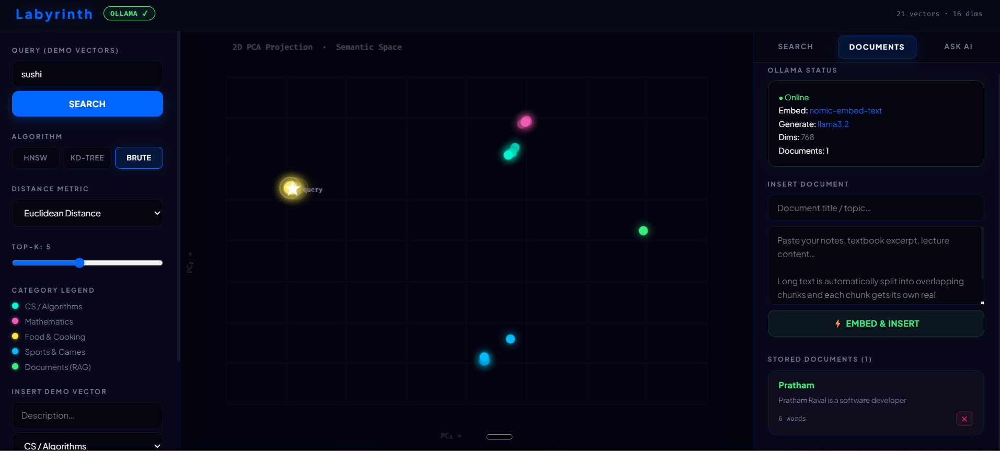
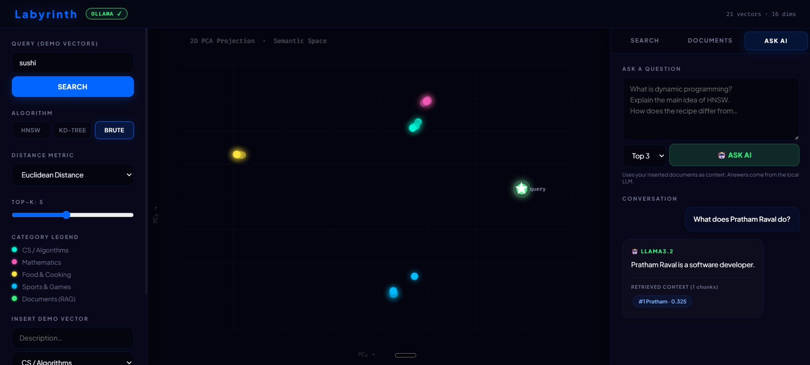

# Labyrinth — Custom AI and RAG Pipeline

A fully-featured, high-performance **Vector Database and Retrieval-Augmented Generation (RAG) Pipeline** built entirely **from scratch in C++** (with a parallel, fully-functional **Java microservice** implementation in Spark Java). 

Labyrinth implements production-grade **Hierarchical Navigable Small World (HNSW)**, spatial **K-Dimensional Tree (KD-Tree)**, and exact **Brute Force** search algorithms from the ground up. It includes an interactive glassmorphic web visualizer with a live 2D PCA projection engine and a local AI RAG pipeline powered entirely offline by **Ollama**.

## 🖥️ Visual Interface Preview

Here is a preview of the premium, high-contrast **Labyrinth** dashboard featuring dynamic 2D PCA semantic projection, real-time algorithm latency benchmarks, and an offline local RAG chat system:





---

## 🚀 Key Architectural Capabilities

### 1. Dual-Core Implementations (C++ & Java)
* **High-Performance C++ Core (`main.cpp`)**: Built as a super-fast, light-weight native binary using standard `std::mutex` locks for thread safety, single-header `cpp-httplib` for low-overhead HTTP routing, and robust JSON parsing.
* **Modular Java Core (`java-rag/`)**: A secondary enterprise-style JVM service implemented in **Java 11+** using **Spark Java** and **Gson**. It mirrors the exact C++ API surface and data structures, enabling students and developers to compare native C++ execution speeds directly with managed JIT compilation.

### 2. Three Vector Search Algorithms Built from Scratch
* **HNSW (Hierarchical Navigable Small World)**:
  * Implements a multilayer scale-free graph structure (conceptually similar to skip-lists).
  * Nodes are randomly assigned a maximum layer using a logarithmic distribution.
  * Search uses a greedy graph descent from the highest layer down to layer 0, followed by a priority queue beam search (`ef_search`) to find candidates.
  * Constructing the index includes a greedy insertion search (`ef_construction`) that links bidirectional edges up to configured degrees (`M` and `M0`), dynamically pruning neighbor lists to preserve optimal small-world routing.
* **KD-Tree (K-Dimensional Tree)**:
  * A spatial-partitioning binary search tree designed for exact nearest neighbor lookups.
  * Cycles splitting axis dimensions at each level of the tree.
  * Prunes subtrees using a hyper-sphere/slab distance check, allowing exact vector space pruning. Highly performant for <=20 dimensions, making it the perfect benchmark for low-dimensional datasets.
* **Brute Force (Flat Index)**:
  * Performs exact vector scans with $O(N \cdot d)$ complexity.
  * Used as a correctness control baseline for distance calculations and as an automatic lightweight fallback when document subsets are too small to justify HNSW graph overhead.

### 3. Integrated Vector Mathematics & Distance Metrics
Labyrinth implements three core geometric metric calculators working seamlessly across arbitrary dimensionalities (from 16D demo models to 768D semantic embeddings):
* **Cosine Similarity**: Measures the angular orientation difference of vectors ignoring magnitude. The default standard metric for semantic text matching.
* **Euclidean Distance ($L_2$)**: Calculates straight-line distance in Euclidean space. Standard for coordinate spatial mapping.
* **Manhattan Distance ($L_1$)**: Computes grid-like absolute differences (Taxicab distance), useful for comparing high-dimensional sparse representations.

### 4. Fully Offline Ollama AI RAG Integration
* **Local Embedding Generation**: A custom HTTP client coordinates with Ollama's local `/api/embeddings` REST endpoints to transform text into high-density **768-dimensional** vector arrays using the `nomic-embed-text` model.
* **Semantic Context Retrieval**: Feeds the embedded query to the HNSW engine, retrieving the top $K$ most semantically relevant text chunks in microseconds.
* **Local Context-Constrained LLM**: Packages the retrieved text chunks inside a structured system prompt, sending it to Ollama's `/api/generate` endpoint using the `llama3.2` model (or `llama3.2:1b` for lower-spec laptops) to formulate precise, context-aware answers without sending any data to external servers.

### 5. Overlapping Text Chunker
* Breaks down raw uploaded text using a whitespace tokenization system.
* Splits documents into sliding windows (default **250 words per chunk**) and maintains a configurable safety overlap (default **30 words**) between consecutive segments. This prevents semantic truncation of details at chunk boundaries.

### 6. Interactive Cyberpunk Web UI & Dashboard
* A glassmorphic dark-mode web dashboard featuring neon-tinted components and smooth animations.
* **2D PCA projection**: Projects 16D semantic coordinates to a visual 2D canvas using Principal Component Analysis, revealing how the neural net forms mathematical clusters of categories (Computer Science, Math, Food, Sports).
* **Benchmark panel**: Runs queries against all three algorithms concurrently, reporting and comparison-plotting execution latency in microseconds.
* **Real-time Chat with Citations**: A conversation UI that displays typewriter-printed answers alongside clickable context chips that highlight exactly which document chunks were referenced.

---

## 📊 How the Pipeline Works

```
                        [Raw Document Upload]
                                  │
                                  ▼
                        [Overlapping Chunker]
                       (250 Words, 30 Overlap)
                                  │
                                  ▼
                      [Ollama Embeddings API]
                     (nomic-embed-text / 768D)
                                  │
                                  ▼
                     [HNSW Multilayer Graph]
                   (Stored inside DocumentDB)
                                  │
                                  ▼
[User Question] ──► [Ollama Embedding] ──► [HNSW Search (Top-K Chunks)]
                                                    │
                                                    ▼
[Generated Answer] ◄── [Ollama Llama 3.2] ◄── [Prompt Compiler]
```

---

## 🛠️ Step-by-Step System Setup

### Prerequisites
1. **MSYS2 (C++ Compiler)**:
   * Download and install from [msys2.org](https://www.msys2.org/).
   * Open **MSYS2 UCRT64** terminal and install `g++` via:
     ```bash
     pacman -Syu
     pacman -S mingw-w64-ucrt-x86_64-gcc
     ```
   * Add `C:\msys64\ucrt64\bin` to your Windows Environment **PATH** variables, then check version via powershell:
     ```powershell
     g++ --version
     ```
2. **Java JDK 11+ & Maven** (Only required if running the Java microservice core):
   * Install standard JDK 11 or higher.
   * Make sure `mvn` and `java` are available in your path.
3. **Ollama (Local AI Engine)**:
   * Download from [ollama.com](https://ollama.com/).
   * Launch your terminal and pull the text embedding and generation models:
     ```powershell
     ollama pull nomic-embed-text
     ollama pull llama3.2
     ```
     *(If your PC runs on low RAM or lacks a dedicated GPU, you can pull the 1-Billion-parameter model instead: `ollama pull llama3.2:1b`)*

---

### 💻 Compiling & Running the Engines

#### Approach A — High-Performance C++ Core
1. **Compile the server**:
   Navigate to the root directory and build using MSYS2's `g++` compiler:
   ```powershell
   g++ -std=c++17 -O2 main.cpp -o db -lws2_32
   ```
2. **Launch the binary**:
   ```powershell
   ./db
   ```
3. **Open the Dashboard**:
   Visit [http://localhost:8080](http://localhost:8080) in your web browser.

---

#### Approach B — Spark Java Core
1. **Navigate to the java project folder**:
   ```powershell
   cd java-rag
   ```
2. **Build the jar package**:
   ```powershell
   mvn clean package
   ```
3. **Run the Spark server**:
   ```powershell
   java -cp target/java-rag-1.0-SNAPSHOT-jar-with-dependencies.jar com.vectordb.Main
   ```
4. **Access the same frontend**:
   The Java engine maps identical endpoints on port `8080`. Go to [http://localhost:8080](http://localhost:8080) in your browser.

---

## 📡 REST API Reference

The Labyrinth engines expose unified REST endpoints designed for two separate database types: **VectorDB** (16D Categorical vectors for mathematical modeling) and **DocumentDB** (768D vectors representing chunked RAG document corpus).

### 1. VectorDB Endpoints (16D Demo Vectors)

| Method | Endpoint | Parameter / Body | Description |
| :--- | :--- | :--- | :--- |
| **GET** | `/search` | `v=0.9,0.8...` (16 floats), `k=5`, `metric=cosine`, `algo=hnsw` | Performs KNN search over the 16D demo vector set |
| **POST** | `/insert` | `{"metadata":"...","category":"...","embedding":[...]}` | Inserts a custom labeled 16D vector |
| **DELETE**| `/delete/:id`| URL Parameter `:id` | Deletes a vector by ID and rebuilds the KD-tree index |
| **GET** | `/items` | None | Lists all in-memory demo items |
| **GET** | `/benchmark`| `v=0.9,0.8...` (16 floats), `k=5`, `metric=cosine` | Queries the exact same vector using HNSW, KD-Tree, and Brute Force, returning execution latencies |
| **GET** | `/hnsw-info`| None | Returns detailed stats of HNSW graphs (nodes, layers, edge lists) |
| **GET** | `/stats` | None | Returns quick database metric statistics |

*Example search curl request:*
```powershell
curl "http://localhost:8080/search?v=0.9,0.85,0.72,0.68,0.12,0.08,0.15,0.1,0.05,0.08,0.06,0.09,0.07,0.11,0.08,0.06&k=3&metric=cosine&algo=hnsw"
```

---

### 2. Document & RAG Pipeline Endpoints (768D Vectors)

| Method | Endpoint | Body JSON | Description |
| :--- | :--- | :--- | :--- |
| **POST** | `/doc/insert` | `{"title": "OS Notes", "text": "A processes is an instance of..."}` | Splits text, generates nomic embeddings, inserts into document indexes |
| **DELETE**| `/doc/delete/:id`| URL Parameter `:id` | Deletes a text chunk from the active RAG indices |
| **GET** | `/doc/list` | None | Retrieves metadata previews of all indexed document chunks |
| **POST** | `/doc/search` | `{"question": "What is a process?", "k": 3}` | Embeds the question and retrieves closest chunk titles and cosine distances |
| **POST** | `/doc/ask` | `{"question": "What is a process?", "k": 3}` | Full RAG pipeline: retrieves matching contexts, compiles the prompt, generates local LLM answer |
| **GET** | `/status` | None | Retrieves connection status to Ollama, loaded models, and doc/demo statistics |

*Example prompt ask curl request:*
```powershell
curl -X POST http://localhost:8080/doc/ask `
  -H "Content-Type: application/json" `
  -d '{"question":"What is dynamic programming?","k":3}'
```

---

## 🔍 Core Algorithms Explored

### Hierarchical Navigable Small World (HNSW)
Unlike standard spatial partitions which degrade in high-dimensional spaces (the "Curse of Dimensionality"), HNSW scales logarithmically. 

Labyrinth builds HNSW dynamically by inserting vectors into a multi-layered highway network graph:
1. **Layer Assignment**: Each node is assigned a max level $l$ using a logarithmic distribution:
  l = floor( -ln(uniform_rand) * mL )
  where:
  mL = 1 / ln(M)
2. **Search Descent**: The search starts at the entry point in the highest layer, traveling greedily to the closest node at that layer. Once a local minimum is hit, it drops down one layer and continues.
3. **Layer Connection**: From the node's maximum assigned layer down to layer 0, the node runs a beam search with size `ef_construction` and links to the closest $M$ (or $M_0$ for layer 0) neighbors.
4. **Dynamic Pruning**: If adding an edge causes a neighbor list to exceed capacity, the list is sorted by distance and the longest edges are pruned.

### K-Dimensional Tree (KD-Tree)
The KD-Tree splits the coordinate space recursively. At each node in the tree:
1. The splitting axis cycles based on depth: $\text{axis} = \text{depth} \bmod \text{dimensions}$.
2. Children represent vectors smaller (left child) or larger/equal (right child) than the parent node along the current axis.
3. **Pruning during KNN**: The search traverses down to the leaf node representing the query point. While backtracking, the search checks if the distance from the query to the splitting hyperplane is smaller than the distance to the current furthest candidate in the nearest-neighbor priority queue. If not, the entire opposite branch is pruned.

---

## 💡 Troubleshooting & Common Questions

#### ⚠️ UI shows "Ollama: OFFLINE" in the header
Make sure Ollama is active on your host system:
* On Windows, make sure the Ollama tray icon is visible.
* Alternatively, run `ollama serve` in a dedicated terminal window.

#### ⚠️ Query benchmarks show KD-Tree is slower than Brute Force
This is expected behavior in high dimensions! In standard 16D space, KD-Tree performs extremely well. However, if you attempt to use KD-Trees for 768-dimensional document embeddings, the mathematical volume of high-dimensional space grows exponentially (curse of dimensionality), causing KD-Tree pruning to fail completely. HNSW avoids this entirely.

#### ⚠️ LLM replies are slow or freeze
Generating answers via `llama3.2` runs locally on your computer's CPU or GPU. CPU execution can take 10-30 seconds depending on core performance.
* **To speed up operations**: Pull and switch to the lighter `llama3.2:1b` model:
  ```powershell
  ollama pull llama3.2:1b
  ```
  Open `main.cpp` (or `Main.java` if using Java) and update the generation model variable:
  ```cpp
  std::string genModel = "llama3.2:1b";
  ```
  Recompile and restart the server!

---

## 📄 License
This project is released under the **MIT License**. Use, modify, and build upon it as you wish!
